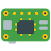

# Raspberry-Pi-Getting-Started 

Build your own portable Raspberry Pi server!

-----------------------------------------
##   Table of Contents   ##
1. [Shopping Cart](#shopping-cart)

-----------------------------------------

## Shopping Cart 
- [CanaKit Raspberry Pi 3 B+ Starter Kit](https://www.amazon.com/gp/product/B07BCC8PK7/) (**$79.99**)
- [SD Card Reader](https://www.amazon.com/Vogek-Card-Reader-USB-Micro/dp/B01IE70PQY/) (**$11.99**)
- [USB to TTL (UART) Serial Adapter](https://www.amazon.com/gp/product/B00DJUHGHI/) (**$10.00**)
- _[Optional]_ [NavoLabs Raspberry Pi 3B+ POE Hat](https://www.amazon.com/gp/product/B07CLCFLH8/) and a [Raspberry Pi Hat-Compatible Enclosure](https://www.amazon.com/gp/product/B01GOSTL7Y/) (**$36.50 + $10.99**)

#### Total w/POE-Options: **$149.47**

-----------------------------------------

## Install the OS 

### NOOBS
- To be filled in by Jay

### Standard Install
1. Download and install [Etcher](https://etcher.io/). Etcher is a Flash Drive/SD Card flashing utility you can use to write the Raspberry Pi OS (Raspbian) to the SD card.
2. [Download Raspbian](https://www.raspberrypi.org/downloads/raspbian/) in the "Lite" (without a GUI) or "Desktop" (with a GUI) format.
3. Unzip the downloaded file to find the .IMG OS file.
4. Use Etcher to burn the .IMG file onto the SD card using your [SD Card Reader](https://www.amazon.com/Vogek-Card-Reader-USB-Micro/dp/B01IE70PQY/)
5. After Etcher has finished burning the image, open the SD card volume to create/modify a few files on the new file system:
	- Create a new, empty file in the root directory called `ssh`. The existence of this file will instruct Raspbian to start the SSH daemon upon first boot
	- Find a file in the root directory called `config.txt`. Edit the file by adding a line at the bottom: `enable_uart=1`. This will enable the GPIO serial pins on the mainboard, allowing you to use your [USB to TTL (UART) Serial Adapter](https://www.amazon.com/gp/product/B00DJUHGHI/) to log into and control the Raspberry Pi when it boots up
6. Power on the Raspberry Pi. You have three options for accessing it:
	1. **Serial Adapter**: Connect the serial adapter to your PC and use a terminal emulator (like Putty or SecureCRT) (at **115200 baud**) to access the command-line of the Raspbian OS
	2. **SSH**: Connect the Raspberry Pi to a network which has DHCP enabled. The Raspberry Pi will pull a DHCP address and you will be able to SSH to it
	3. **Keyboard, Mouse, and Display**: Connect your KVM set to the Raspberry Pi (requires a HDMI display connection) and access it as you would any other server
7. Log into the Raspberry Pi using the default credentials:
	- Username: **pi**
	- Password: **raspberry**
8. Change your password using the command `sudo passwd pi`
9. If neccesary, perform some [Post-Install Setup](https://github.com/PackeTsar/scriptfury/blob/master/Raspbian_Post_Install.md) steps

### Congrats, you now have a portable Raspberry Pi server!
